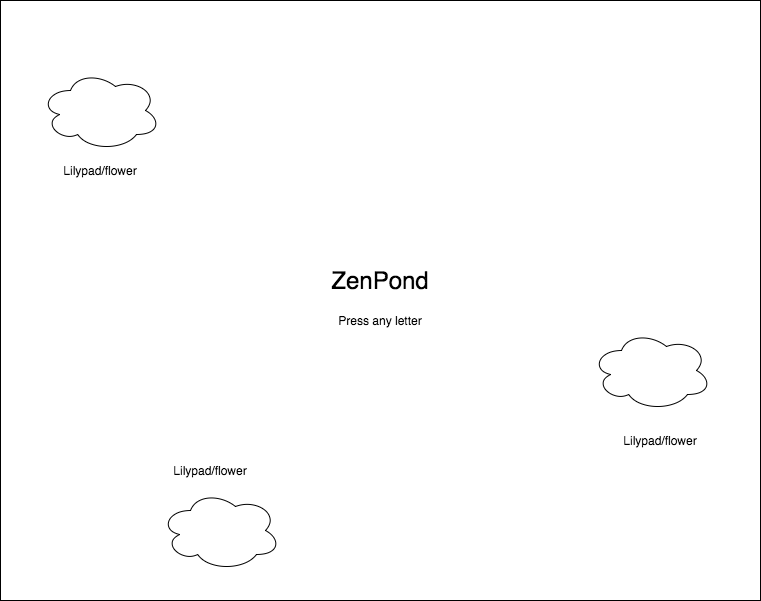

## Zen Pond

**NOTE**: I am aware this project may be either too ambitious or make too much use of external libraries, and have backup ideas if that is the case.

### Background

The idea behind Zen Pond is simple: transport the user away from stress and responsibility with an invitation to experience the simple joy of making music. Using their keyboard, the user will strike piano keys, allowing them to make simple ditties and complex melodies alike. Each keystroke will produce a single ripple in a pond filling the entire screen, with the occasional lilypad or cherry blossom floating by. This will be accompanied by soft water sounds, as well as distant chirpings of small birds.

### Functionality & MVP

Zen Pond features will include:

- [ ] The ability to produce a significant number of piano tones using the keyboard, featuring realistic responses to long and short keystrokes
- [ ] A tranquil pond covering the screen, featuring realistic ripples upon each keystroke, and occasional floating lilypads or flowers
- [ ] Light water sounds and birdsong in the background

In addition this project will include:

- [ ] A production README

### Wireframes

This app will have a single screen and a very minimal interface. The sole method of user interaction will be to press letter keys to create piano tones and ripples.

### Architecture and Technologies

This project will be implemented with the following technologies:

- Vanilla JavaScript and `jquery` for structure, as well as generating floating objects
- `jquery` Ripples plugin to produce water effects
- `Tone.js` for producing piano tones and auxiliary sound effects

### Implementation Timeline

**Day 1**: Setup all configuration, including Node modules and webpack config. Define the basic entry files and start learning how to produce sounds with `Tone.js`. Daily goals:

- Successfully configure and bundle all files
- Produce simple notes with `Tone.js`

**Day 2**: Learn how to produce specific piano tones and create key bindings for them. Daily goals:

- Have full keyboard mapping working and producing intended sounds, ideally with the intended effects of holding keys

**Day 3**: Start designing the page, and learn to produce ripple effects. Ideally, start working on floating objects. Daily goals:

- Have basics of page appearance rendering, including ripple effects on keystrokes
- If time, start building floating objects i.e. lilypads/flowers

**Day 4**: Build floating objects, including physical reactions to ripples. Add background sounds. Daily goals:

- Include floating objects on pond surface, featuring reactions to being hit by ripples
- Add background noises such as water sounds and birdsong

### Bonus features

Some ideas for updates for this page:

- [ ] Add fish to occasionally swim across the screen with realistic behavior
- [ ] Add light distortion beneath the water
- [ ] Add pre-composed songs to play to see water effects
